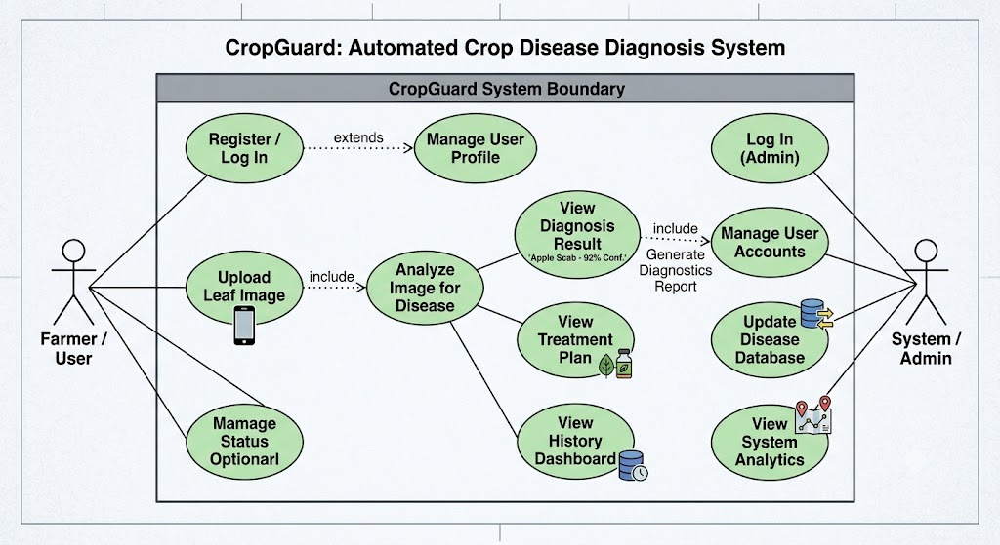

# CropGuard: Automated Crop Disease Diagnosis System

An intelligent computer vision platform designed to help farmers detect, classify, and mitigate crop diseases instantly from leaf images.

---

## 📋 Project Specifications

### Problem Statement
Traditional crop disease identification relies on manual visual inspection, which is slow, error-prone, and often accessible too late. CropGuard automates this entire pipeline using Deep Learning to detect anomalies early, saving yields and optimizing resource management.

### Tech Stack
* **Frontend:** Mobile/Web Application (e.g., Flutter, React)
* **Backend:** REST API (e.g., FastAPI, Flask)
* **Machine Learning:** Computer Vision Models (e.g., CNN, ResNet50, YOLO)
* **Database:** Structured Storage (e.g., PostgreSQL, SQLite)

### Key Features
* 📸 **Instant Image Capture:** Upload or snap leaf photos directly via mobile.
* 🧠 **AI Diagnosis:** Highly accurate classification of crop diseases.
* 💊 **Treatment Roadmap:** Integrated expert treatment suggestions.
* 📊 **History Dashboard:** Tracks past diagnoses and geographic spread.

---

## 🔬 Deep Learning Model Classes

The classification engine evaluates incoming leaf imagery against an optimized 10-class dataset covering core agricultural staples:

| Class ID | Target Crop | Condition / Disease Status | Diagnostic Category |
| :--- | :--- | :--- | :--- |
| **Model_Class_01** | Apple | Scab (*Venturia inaequalis*) | Fungal |
| **Model_Class_02** | Apple | Healthy | Healthy Leaf |
| **Model_Class_03** | Corn (Maize) | Common Rust (*Puccinia sorghi*) | Fungal |
| **Model_Class_04** | Corn (Maize) | Healthy | Healthy Leaf |
| **Model_Class_05** | Potato | Early Blight (*Alternaria solani*) | Fungal |
| **Model_Class_06** | Potato | Late Blight (*Phytophthora infestans*) | Oomycete / Water Mold |
| **Model_Class_07** | Potato | Healthy | Healthy Leaf |
| **Model_Class_08** | Tomato | Bacterial Spot (*Xanthomonas*) | Bacterial |
| **Model_Class_09** | Tomato | Yellow Leaf Curl Virus | Viral |
| **Model_Class_10** | Tomato | Healthy | Healthy Leaf |

---

## 🗺️ System Architecture & Diagrams

### 1. Use Case Diagram
The following diagram illustrates how the Farmer and the Admin interact with the different functional modules of the system.

