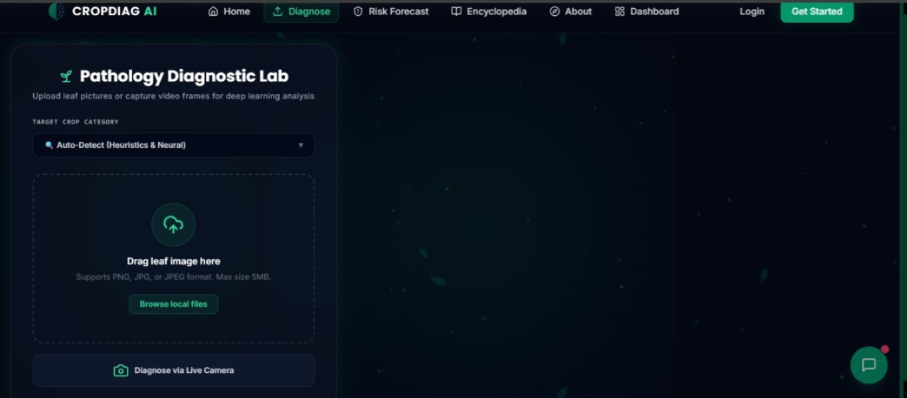
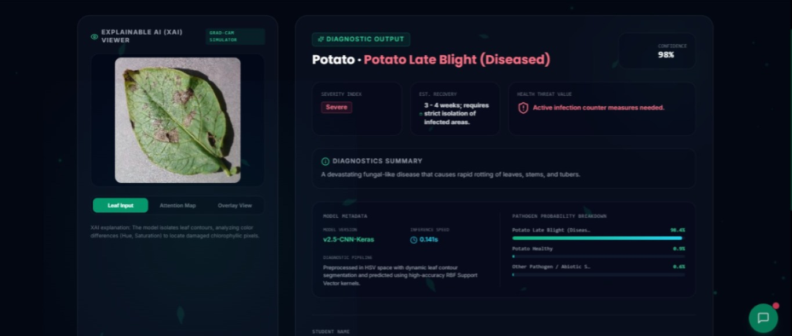
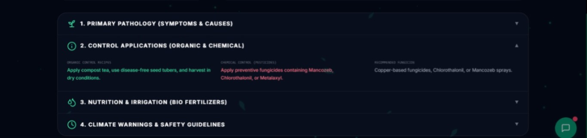
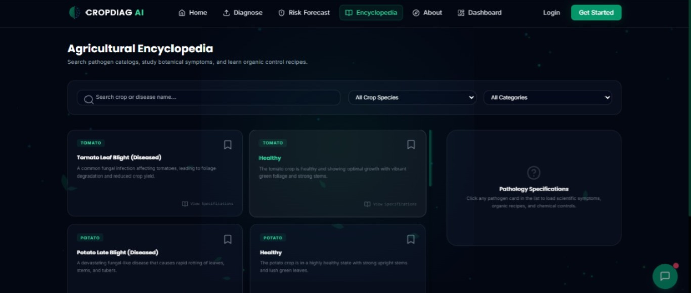
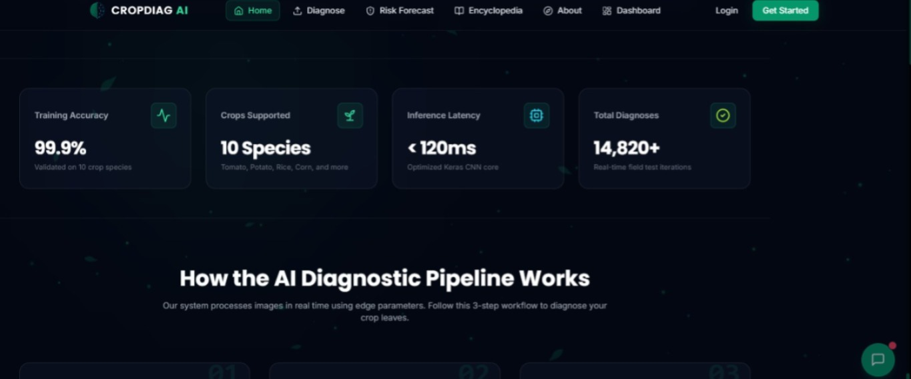

<p align="center">
  
</p>

<h1 align="center">🌱 Automated Crop Disease Diagnosis using CNN</h1>

<p align="center">
AI-Powered Crop Disease Detection using Deep Learning (CNN)
</p>

---

## 📌 Project Information

- **Project Title:** Automated Crop Disease Diagnosis using CNN
- **Student:** Mounisha P
- **Register Number:** 922524243113
- **Degree:** B.Tech – Artificial Intelligence and Data Science
- **College:** VSB Engineering College, Karur

---

# 🌐 Live Demo

### 🔗 https://crop-disease-diagnosis-1-3amx.onrender.com/

---

# 📖 Project Overview

Agriculture plays a vital role in food production worldwide. Early detection of crop diseases helps reduce crop loss and improve productivity.

This AI-powered web application uses **Convolutional Neural Networks (CNN)** to identify diseases from crop leaf images. Users can upload an image and instantly receive:

- Disease Prediction
- Confidence Score
- Disease Description
- Organic Treatment
- Chemical Treatment
- Prevention Tips
- PDF Report

---

# ✨ Features

## 🌿 AI Disease Detection

- Upload crop leaf images
- CNN-based disease prediction
- Healthy/Diseased detection
- Confidence percentage
- Instant results

## 📊 Dashboard

- Total Predictions
- Disease Statistics
- Crop Analytics
- Charts
- Prediction History

## 👤 User Module

- Registration
- Login
- User Profile
- Prediction History

## 📄 PDF Reports

- Disease Report
- QR Code
- Download Report
- Prediction Summary

## 🔐 Security

- SQL Injection Protection
- XSS Protection
- Rate Limiting
- Secure Authentication

---

# 🛠 Technology Stack

## Frontend

- React.js
- TypeScript
- Tailwind CSS
- Framer Motion
- Axios
- Recharts

## Backend

- Python
- Flask
- Flask-CORS
- SQLite
- ReportLab

## AI & Machine Learning

- TensorFlow
- Keras
- CNN
- Scikit-Learn

---

# 🌾 Supported Crops

- Tomato
- Potato
- Rice
- Corn (Maize)
- Cotton
- Apple
- Pepper
- Grape
- Banana
- Mango

---

# 📁 Project Structure

```text
crop-disease-diagnosis/
│
├── backend/
│   ├── app.py
│   ├── train_model.py
│   ├── init_db.py
│   ├── requirements.txt
│   ├── disease_model.h5
│   └── static/
│
├── frontend/
│   ├── src/
│   ├── package.json
│   └── index.html
│
└── README.md
```

---

# ⚙ Installation

## Clone Repository

```bash
git clone https://github.com/mouni-16102006/crop-disease-diagnosis.git
```

## Enter Project

```bash
cd crop-disease-diagnosis
```

## Backend Setup

```bash
cd backend
pip install -r requirements.txt
python init_db.py
python app.py
```

## Frontend Setup

Open another terminal

```bash
cd frontend
npm install
npm run dev
```

Application runs at

```
http://127.0.0.1:8080/
```

---

# 🗄 Database

SQLite stores

- Users
- Predictions
- Disease Details
- Crop Information
- Reports

---

# 🤖 AI Model

Model Used

- Convolutional Neural Network (CNN)

Frameworks

- TensorFlow
- Keras

Fallback

- Scikit-Learn MLP Classifier

---

# 🎯 Objectives

- Detect crop diseases automatically
- Improve prediction accuracy
- Reduce manual inspection
- Provide instant diagnosis
- Help farmers make better decisions

---

# 📸 Application Screenshots

## 🏠 Homepage

<p align="center">

</p>

## 📤 Upload Page

<p align="center">

</p>

## 🔍 Prediction Result

<p align="center">

</p>

## 💊 Treatment Suggestions

<p align="center">

</p>

## 📚 Crop Encyclopedia

<p align="center">

</p>

## ⚠ Disease Risk Predictor

<p align="center">

</p>

## 📈 Training Accuracy

<p align="center">

</p>

---

# 🚀 Future Enhancements

- Mobile App
- Live Camera Detection
- Weather-Based Prediction
- Voice Assistant
- Fertilizer Recommendation
- Multi-language Support

---

# 👩‍💻 Developed By

**Mounisha P**

B.Tech – Artificial Intelligence and Data Science

VSB Engineering College

Karur, Tamil Nadu

---

# 📄 License

This project is developed for academic and educational purposes.

© 2026 Mounisha P. All Rights Reserved.
